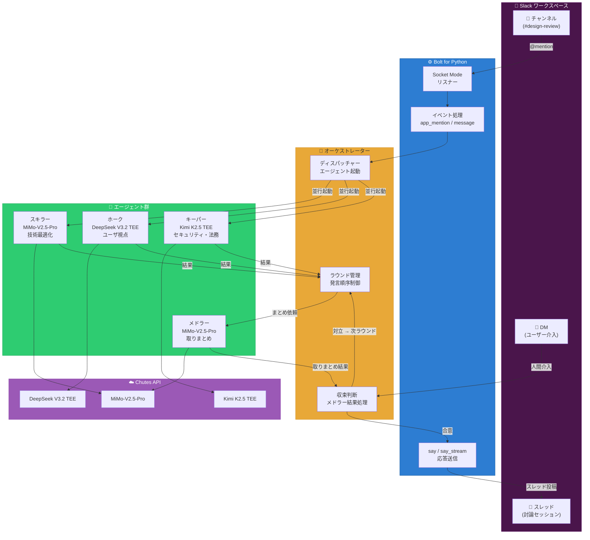
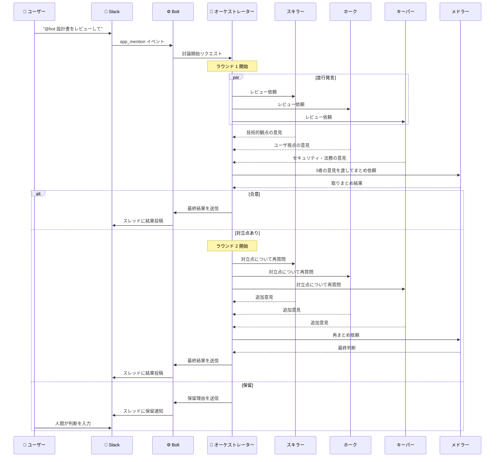
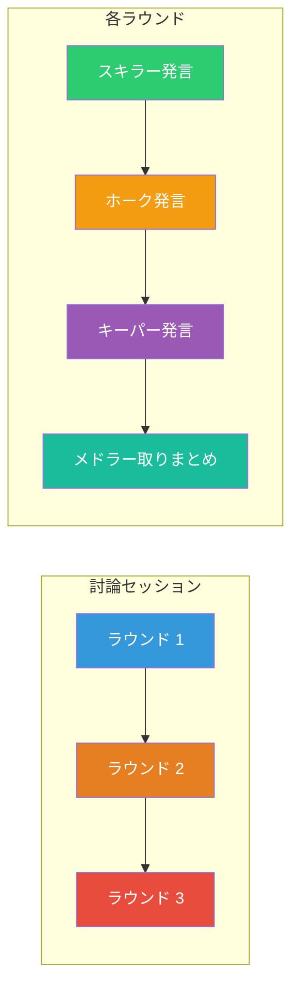

# Slack 動作環境案

作成日: 2026-05-15

> 2026-05-24 時点では MoChat を初期チャット基盤として採用するため、この文書は候補・代替案として保持する。

## 概要

討論エージェント（スキラー、ホーク、キーパー、メドラー）を Slack 上で動作させるための技術スタック。

---

## 1. 技術スタック

### 1.1 Slack ボットフレームワーク

| コンポーネント | 技術 | 理由 |
|---|---|---|
| SDK | **Bolt for Python** | Slack 公式 SDK。Socket Mode / HTTP Mode 両対応 |
| 接続方式 | **Socket Mode** | 公開URL不要。ローカル開発・ファイアウォール内でも動作 |
| 言語 | **Python 3.12+** | OpenAI SDK、Bolt、LangGraph との互換性 |

### 1.2 LLM クライアント

| コンポーネント | 技術 | 理由 |
|---|---|---|
| LLM SDK | **OpenAI SDK (Python)** | Chutes 経由で全モデル共通 |
| API | **Chutes API** | MiMo-V2.5-Pro、DeepSeek V3.2 TEE、Kimi K2.5 TEE にアクセス |

### 1.3 オーケストレーション

| コンポーネント | 技術 | 理由 |
|---|---|---|
| 討論管理 | **自前実装** | 討論プロトコル（ラウンド管理、収束判断）に合わせて設計 |
| 状態管理 | **Slack スレッド** | 各討論をスレッドで管理。会話履歴は Slack が保持 |
| ファイル監視 | **watchfiles** | プロンプトファイル生成のトリガー検知用 |

### 1.4 Slack App 設定

| 設定 | 値 |
|---|---|
| 接続方式 | Socket Mode |
| Bot Token Scopes | `app_mentions:read`, `channels:history`, `chat:write`, `groups:history`, `im:history`, `reactions:read`, `reactions:write` |
| Event Subscriptions | `app_mention`, `message.groups`, `message.im` |
| 機能 | スレッド返信、ストリーミング応答、リアクション |

---

## 2. 概念図（Mermaid）

### 2.1 全体構成



### 2.2 討論フロー（詳細）



### 2.3 エージェント間メッセージフロー



---

## 3. 実装方針

### 3.1 Slack スレッド設計

- 各討論セッションは1つのスレッドで管理
- スレッド内でエージェントが順番に発言
- メドラーの取りまとめはスレッド内に投稿
- ユーザーはスレッド内でいつでも介入可能

### 3.2 エージェントの発言形式

```
【スキラー】
技術的観点からの意見:
- ...

【ホーク】
ユーザ視点からの意見:
- ...

【キーパー】
セキュリティ・法務の観点からの意見:
- ...

【メドラー】■ 取りまとめ
合意点: ...
対立点: ...
判断: 合意 / 保留
```

### 3.3 トリガー方式

| トリガー | 方法 |
|---|---|
| ユーザー指示 | `@mention` でエージェント起動 |
| 定期レビュー | Slack Workflow Builder + cron |
| ファイル変更 | watchfiles → Slack にメッセージ投稿 |

---

## 4. 参考プロジェクト

| プロジェクト | 特徴 | 参考価値 |
|---|---|---|
| **agentslack** (Princeton) | マルチエージェントのSlack通信層。並行ワールド、リアルタイム監視 | ★★★★★ |
| **python-slack-agents** | YAML設定ベースのエージェント。MCP tools対応 | ★★★★ |
| **SlackAgents** (Salesforce) | マルチエージェント協調。ワークフローエージェント | ★★★★ |
| **xDebate** | LangGraph ベースの討論フレームワーク。役割分化 | ★★★★★ |
| **ARGUS** | 討論ネイティブフレームワーク。ベイズ推論 | ★★★★ |
