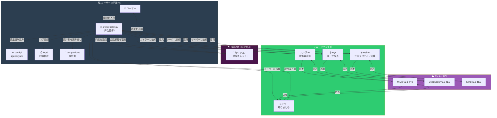
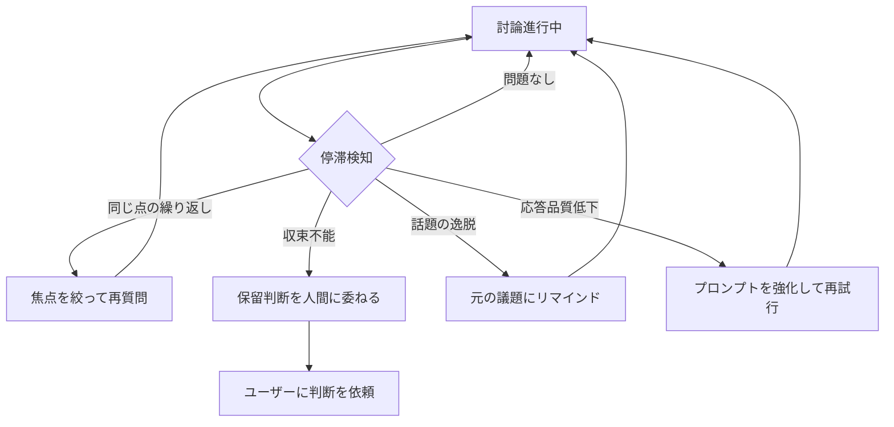

# 討論システム概念図

作成日: 2026-05-15

---

## 登場人物一覧

| 名前 | 種類 | 場所 | 役割 |
|---|---|---|---|
| **ユーザー** | 人間 | 手元のPC | 議題を入力し、結果を受け取る |
| **src/debate/orchestrator.py** | Pythonプログラム | 手元のPC | 討論の流れを制御する舞台監督 |
| **src/debate/monitor.py** | Pythonプログラム | 手元のPC | 討論の停滞を検知し、リセット機能を提供 |
| **src/debate/protocol.py** | Pythonプログラム | 手元のPC | ラウンド、発言順序、終了条件を定義する |
| **src/debate/convergence.py** | Pythonプログラム | 手元のPC | メドラー出力を合意/対立/保留に正規化する |
| **src/mochat/client.py** | Pythonプログラム | 手元のPC | MoChat API の送受信を担当する |
| **スキラー** | LLMエージェント | Chutes API | 技術最適化 + 堅牢性 |
| **ホーク** | LLMエージェント | Chutes API | ユーザ視点 + 要件拡充 |
| **キーパー** | LLMエージェント | Chutes API | セキュリティ + 法務 + 経理 |
| **メドラー** | LLMエージェント | Chutes API | 取りまとめ + 合意形成 |
| **MoChat** | チャットプラットフォーム | mochat.io | 会話の舞台（掲示板） |
| **Chutes API** | LLMプロバイダ | chutes.ai | 各エージェントの「脳」を提供 |
| **config/** | 設定ファイル群 | 手元のPC | エージェント設定。secret 本体は `config/local/` に分離する |
| **config/local/** | ローカル認証情報 | 手元のPC | MoChat トークンなどの未公開情報。`.gitignore` で除外する |
| **prompt-templates/** | テンプレート群 | 手元のPC | 各エージェントへのプロンプトテンプレート |
| **logs/** | ログ出力 | 手元のPC | 討論履歴の記録 |
| **docs/debate-results/** | 成果物 | 手元のPC | 討論結果のMarkdown出力 |
| **design-docs** | 設計書 | 手元のPC | レビュー対象の設計書 |

---

## 概念図（Mermaid）

### 全体構成



### 討論フロー（シーケンス図）

```mermaid
sequenceDiagram
    participant U as 👤 ユーザー
    participant O as 🎯 orchestrator.py
    participant M as 💬 MoChat
    participant SK as スキラー
    participant HK as ホーク
    participant KP as キーパー
    participant MD as メドラー

    U->>O: 「この設計書をレビューして」
    O->>O: 設計書を読み込む
    O->>M: セッション作成
    O->>M: 議題を投稿

    Note over O: ラウンド 1 開始

    O->>SK: 設計書 + 議題を渡して依頼
    SK->>SK: Chutes API で思考
    SK-->>O: 技術的観点の意見
    O->>M: 【スキラー】意見を投稿

    O->>HK: 設計書 + 議題 + スキラー意見を渡して依頼
    HK->>HK: Chutes API で思考
    HK-->>O: ユーザ視点の意見
    O->>M: 【ホーク】意見を投稿

    O->>KP: 設計書 + 議題 + 全意見を渡して依頼
    KP->>KP: Chutes API で思考
    KP-->>O: セキュリティ・法務の意見
    O->>M: 【キーパー】意見を投稿

    O->>MD: 全意見を渡して取りまとめ依頼
    MD->>MD: Chutes API で思考
    MD-->>O: 取りまとめ結果（合意/対立/保留）
    O->>M: 【メドラー】取りまとめを投稿

    alt 合意
        O->>U: 結果を表示
    else 対立点あり
        Note over O: ラウンド 2 開始
        O->>SK: 対立点について再質問
        ...
    else 保留
        O->>U: 保留理由を表示。判断を依頼
    end
```

---

## 概念図（ASCII）

### 全体構成

```
┌─────────────────────────────────────────────────────────────────────┐
│                    💻 ユーザーの手元PC                               │
│                                                                     │
│  ┌──────────┐    ┌─────────────────────┐    ┌──────────────────┐   │
│  │ 👤       │    │ 🎯 orchestrator.py  │    │ ⚙️ config/       │   │
│  │ ユーザー  │───▶│ （舞台監督）         │◀──▶│ agents.yaml      │   │
│  │          │◀───│                     │    │                  │   │
│  └──────────┘    └──────────┬──────────┘    └──────────────────┘   │
│       ▲                     │                                       │
│       │                     ▼                                       │
│       │          ┌─────────────────────┐    ┌──────────────────┐   │
│       │          │ 📄 design-docs/     │    │ 📋 logs/         │   │
│       │          │ 設計書              │    │ 討論履歴          │   │
│       │          └─────────────────────┘    └──────────────────┘   │
│       │                                                             │
└───────┼─────────────────────────────────────────────────────────────┘
        │
        │ ① 議題入力 / ⑧ 結果表示
        │
        ▼
┌─────────────────────────────────────────────────────────────────────┐
│                    ☁️ MoChat (mochat.io)                            │
│                                                                     │
│  ┌─────────────────────────────────────────────────────────────┐   │
│  │ 💬 セッション（討論スレッド）                                 │   │
│  │                                                             │   │
│  │  【スキラー】技術的観点から...                                │   │
│  │  【ホーク】  ユーザ視点で...                                  │   │
│  │  【キーパー】セキュリティ面で...                              │   │
│  │  【メドラー】■ 取りまとめ...                                  │   │
│  └─────────────────────────────────────────────────────────────┘   │
│                                                                     │
└─────────────────────────────────────────────────────────────────────┘
        ▲                               ▲
        │ ② 発言送信                    │ ③ 会話履歴取得
        │                               │
        ▼                               │
┌───────────────────────────────────────┴─────────────────────────────┐
│                    🎯 orchestrator.py の処理                         │
│                                                                     │
│  for round in 1..MAX_ROUNDS:                                        │
│      for agent in [skiller, hawk, keeper]:                          │
│          history = mochat.get_messages(session_id)   ← ③            │
│          prompt = build_prompt(agent, history, design_doc)           │
│          response = chutes.call(agent.model, prompt)  ← ④          │
│          mochat.send(session_id, response)           ← ②           │
│                                                                     │
│      history = mochat.get_messages(session_id)                      │
│      summary = mediator.summarize(history)                          │
│      mochat.send(session_id, summary)                               │
│                                                                     │
└─────────────────────────────────────────────────────────────────────┘
        │
        │ ④ LLM 呼び出し
        ▼
┌─────────────────────────────────────────────────────────────────────┐
│                    ☁️ Chutes API (chutes.ai)                        │
│                                                                     │
│  ┌────────────────┐ ┌────────────────┐ ┌────────────────┐          │
│  │ MiMo-V2.5-Pro  │ │DeepSeek V3.2 TEE│ │ Kimi K2.5 TEE  │          │
│  │                │ │ (thinking)     │ │ (thinking)     │          │
│  │ スキラー用     │ │ ホーク用       │ │ キーパー用     │          │
│  │ メドラー用     │ │                │ │                │          │
│  └────────────────┘ └────────────────┘ └────────────────┘          │
│                                                                     │
└─────────────────────────────────────────────────────────────────────┘
```

### 討論フロー（フローチャート）

```
                    ┌─────────────────┐
                    │ 👤 ユーザー      │
                    │ 議題を入力      │
                    └────────┬────────┘
                             │
                             ▼
                    ┌─────────────────┐
                    │ 🎯 orchestrator │
                    │ 設計書を読み込む│
                    └────────┬────────┘
                             │
                             ▼
                    ┌─────────────────┐
                    │ 💬 MoChat       │
                    │ セッション作成  │
                    └────────┬────────┘
                             │
                             ▼
              ┌──────────────────────────────┐
              │        ラウンド 1 開始        │
              └──────────────┬───────────────┘
                             │
         ┌───────────────────┼───────────────────┐
         ▼                   ▼                   ▼
  ┌─────────────┐    ┌─────────────┐    ┌─────────────┐
  │ 🟢 スキラー │    │ 🟡 ホーク   │    │ 🟣 キーパー │
  │ 技術観点    │    │ ユーザ視点  │    │ セキュリティ│
  │             │    │             │    │ 法務・経理  │
  └──────┬──────┘    └──────┬──────┘    └──────┬──────┘
         │                  │                  │
         └──────────────────┼──────────────────┘
                            │
                            ▼
                   ┌─────────────────┐
                   │ 🟠 メドラー     │
                   │ 取りまとめ      │
                   │ 合意/対立/保留  │
                   └────────┬────────┘
                            │
              ┌─────────────┼─────────────┐
              ▼             ▼             ▼
        ┌──────────┐  ┌──────────┐  ┌──────────┐
        │   合意   │  │  対立    │  │  保留    │
        │ 結果出力 │  │ 次ラウンド│  │ 人間に  │
        │          │  │ へ      │  │ 判断委ね │
        └──────────┘  └──────────┘  └──────────┘
```

---

## データフロー

```
ユーザー ──[議題テキスト]──▶ orchestrator.py
                                │
                                ├──[プロンプト]──▶ Chutes API ──[応答]──▶ orchestrator.py
                                │
                                ├──[メッセージ]──▶ MoChat API ──[送信完了]──▶ orchestrator.py
                                │
                                ├──[会話履歴]──◀ MoChat API ──[履歴]── orchestrator.py
                                │
                                └──[ログ]──▶ logs/ ディレクトリ
```

---

## 推奨追加コンポーネント

### 一覧

| コンポーネント | 種類 | 場所 | 理由 |
|---|---|---|---|
| **config/agents.yaml** | 設定ファイル | 手元のPC | エージェントの設定とコードを分離。調整しやすくする |
| **logs/** | ログディレクトリ | 手元のPC | 討論履歴のバックアップと分析用データ |
| **docs/debate-results/** | 成果物ディレクトリ | 手元のPC | 討論の成果物。設計書に反映する際の元ネタ |
| **prompt-templates/** | テンプレートディレクトリ | 手元のPC | プロンプトの品質改善をコード変更なしで行う |
| **src/debate/monitor.py** | 監視プログラム | 手元のPC | 討論の停滞を検知し、リセット機能を提供 |

### config/agents.yaml

```yaml
agents:
  skiller:
    name: "スキラー"
    model: "xiaomi/MiMo-V2.5-Pro"
    system_prompt: "prompt-templates/skiller-system.md"
    temperature: 0.7

  hawk:
    name: "ホーク"
    model: "deepseek-ai/DeepSeek-V3.2-TEE"
    mode: "thinking"
    system_prompt: "prompt-templates/hawk-system.md"
    temperature: 0.8

  keeper:
    name: "キーパー"
    model: "moonshotai/Kimi-K2.5-TEE"
    mode: "thinking"
    system_prompt: "prompt-templates/keeper-system.md"
    temperature: 0.6

  mediator:
    name: "メドラー"
    model: "xiaomi/MiMo-V2.5-Pro"
    system_prompt: "prompt-templates/mediator-system.md"
    temperature: 0.5

debate:
  max_rounds: 3
  output_dir: "docs/debate-results"
  reset_threshold: 0.8
```

secret は `config/agents.yaml` に書かない。MoChat トークンや Chutes API キーは環境変数または `.gitignore` 済みの `config/local/` 配下から読み込む。

**なぜ必要か:**
- プロンプトの調整頻度が高い（討論の質はプロンプトに大きく依存する）
- モデルの切り替えをコード変更なしで行いたい
- temperature や max_tokens などのパラメータを実験的に調整したい

### logs/

```
logs/
  2026-05-15_design-review_round1.json
  2026-05-15_design-review_round2.json
  2026-05-15_design-review_summary.md
```

**なぜ必要か:**
- MoChat 上の会話は MoChat 側に依存。MoChat がダウンしたら会話履歴が失われる
- 討論の品質を後から分析するための生データが必要
- 「なぜこの結論に至ったか」の根拠を残すため
- JSON 形式で保存すれば、後からプログラム的に分析できる

### docs/debate-results/

```
docs/debate-results/
  2026-05-15_design-review.md
```

```markdown
# 討論結果: 設計書レビュー

## 議題
docs/spec/architecture.md のレビュー

## ラウンド 1
### スキラー（技術観点）
- ...
### ホーク（ユーザ視点）
- ...
### キーパー（セキュリティ・法務）
- ...
### メドラー（取りまとめ）
- 合意点: ...
- 対立点: ...
- 判断: 合意 / 保留

## 最終結論
...
```

**なぜ必要か:**
- 討論結果を設計書に反映する際の「元ネタ」が必要
- Markdown 形式なら Obsidian や GitHub で閲覧・検索できる
- 討論の「成果物」として残すことで、PJ の意思決定履歴になる

### prompt-templates/

```
prompt-templates/
  skiller-system.md
  hawk-system.md
  keeper-system.md
  mediator-system.md
  discussion-round.md
```

**なぜ必要か:**
- プロンプトは討論の質に直結する最重要パラメータ
- コード内に埋め込むと、調整のたびにコードを読んで探し出して編集する必要がある
- ファイルに分離すれば、プロンプトだけを集中して改善できる
- バージョン管理（git）でプロンプトの変更履歴を追跡できる

---

## 討論停滞検知・リセット機能

### 概要

討論がうまく進んでいない場合、orchestrator.py が自動的に検知し、リセットや軌道修正を行う機能。

### 停滞パターンと検知条件

| パターン | 検知方法 | 具体例 |
|---|---|---|
| **同じ点の繰り返し** | 直前ラウンドと現在ラウンドの意見の類似度が高い | スキラーが3ラウンド連続で同じ指標を繰り返す |
| **議論の収束不能** | メドラーの取りまとめが「対立」を3回連続で返す | スキラーとホークが同じ主張を譲らない |
| **話題の逸脱** | 最初の議題からかけ離れた話題になっている | 討論が実装詳細に深入りして設計の議論が止まる |
| **応答品質の低下** | エージェントの応答が極端に短くなったり、無関係な内容になっている | 「同意します」だけの応答が続く |

### リセット戦略



### 実装イメージ

```python
class DebateMonitor:
    def __init__(self, config):
        self.max_stagnant_rounds = config.get("max_stagnant_rounds", 2)
        self.similarity_threshold = config.get("similarity_threshold", 0.8)

    def check_stagnation(self, round_history):
        """討論の停滞を検知する"""
        issues = []

        # 1. 同じ点の繰り返し検知
        if self._is_repetitive(round_history):
            issues.append("repetition")

        # 2. 収束不能検知
        if self._is_stuck(round_history):
            issues.append("stuck")

        # 3. 話題の逸脱検知
        if self._is_off_topic(round_history):
            issues.append("off_topic")

        # 4. 応答品質低下検知
        if self._is_quality_degraded(round_history):
            issues.append("quality_degraded")

        return issues

    def suggest_action(self, issues):
        """停滞パターンに基づいて対応を提案する"""
        if "repetition" in issues:
            return "focus"  # 焦点を絞って再質問
        elif "stuck" in issues:
            return "preserve"  # 保留判断を人間に委ねる
        elif "off_topic" in issues:
            return "remind"  # 元の議題にリマインド
        elif "quality_degraded" in issues:
            return "strengthen"  # プロンプトを強化して再試行
        else:
            return "continue"  # そのまま続行
```

### orchestrator.py への統合

```python
def run_debate(session_id, topic):
    monitor = DebateMonitor(config)

    for round_num in range(1, MAX_ROUNDS + 1):
        # 各エージェントが発言
        for agent in [skiller, hawk, keeper]:
            response = agent.discuss(history)
            mochat.send(session_id, response)

        # メドラーが取りまとめ
        summary = mediator.summarize(history)

        # 停滞検知
        issues = monitor.check_stagnation(history)
        action = monitor.suggest_action(issues)

        if action == "continue":
            # そのまま続行
            pass
        elif action == "focus":
            # 焦点を絞って再質問
            topic = f"以下の点に焦点を当てて議論してください: {summary['conflicts']}"
        elif action == "remind":
            # 元の議題にリマインド
            mochat.send(session_id, f"元の議題に戻りましょう: {topic}")
        elif action == "preserve":
            # 保留判断を人間に委ねる
            mochat.send(session_id, "討論が収束しません。人間の判断を待ちます。")
            return summary
        elif action == "strengthen":
            # プロンプトを強化して再試行
            for agent in [skiller, hawk, keeper]:
                agent.strengthen_prompt()
```

### 設定パラメータ

```yaml
# config/agents.yaml
debate:
  max_rounds: 3
  monitor:
    enabled: true
    max_stagnant_rounds: 2      # 何ラウンド連続で停滞と判断するか
    similarity_threshold: 0.8   # 意見の類似度の閾値
    min_response_length: 50     # 応答の最低文字数
    off_topic_threshold: 0.3    # 話題の逸脱判定閾値
```
